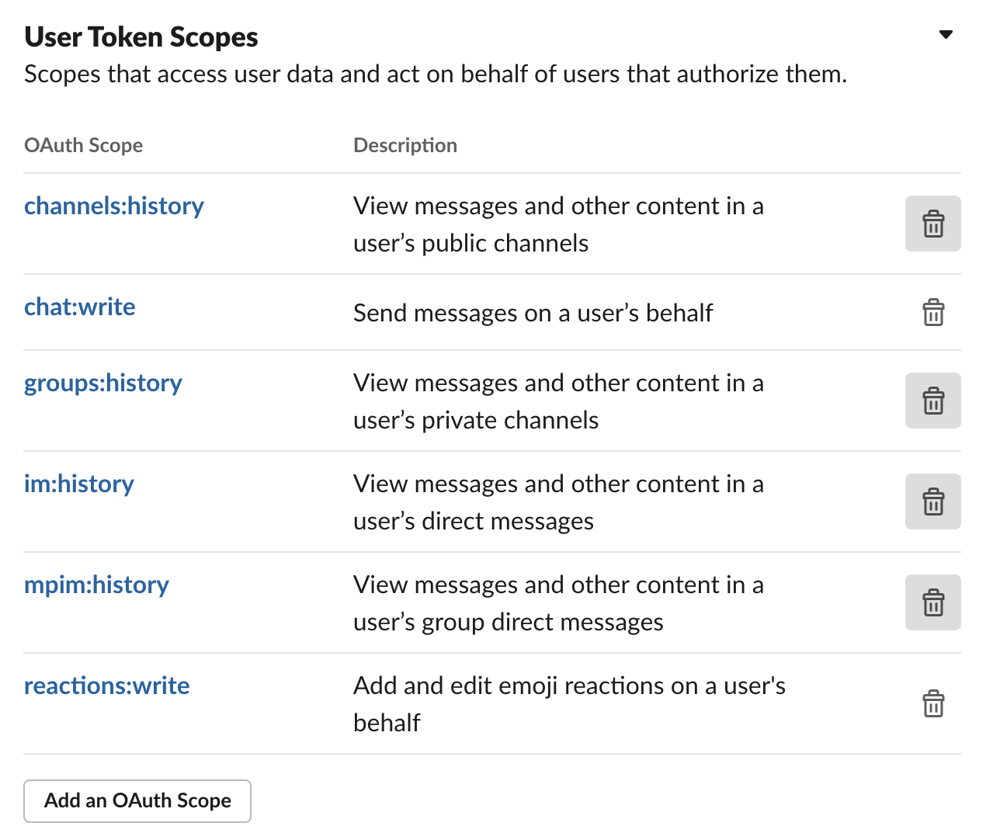
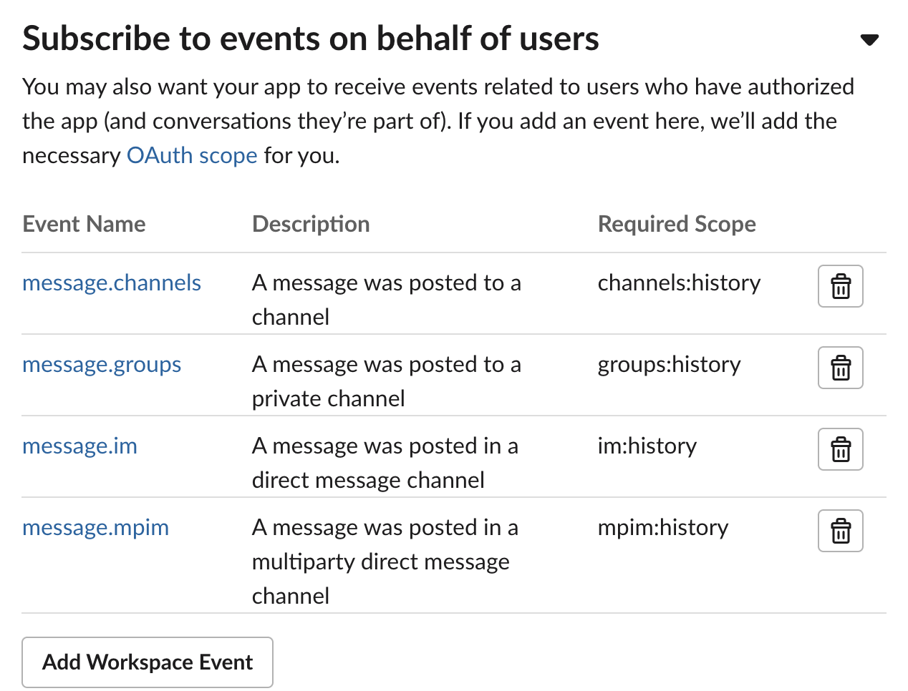

# YubiSnooze
Slack bot to automatically delete yubisneeze / accidental yubikey presses.

It will search using the regex `"[cbdefghijklnrtuv]{44}"` and if that is the entire message will replace it with a response. If the token is within a message it will simply just the token with a reaction.

It will react to the new message in both cases.

# Example

# Installation
## Python install
Install the app on an Internet facing server (or configure ngrok/other):

`pip3 install -r requirements.txt`

## Setup Slack API
- Create a Slack app on https://api.slack.com/apps
- Add a bot user for your app
- Add user token scopes as per your requirements:

- Set the `SLACK_BOT_TOKEN` and `SLACK_SIGNING_SECRET` env variables
- Configure python script where neccessary if you want to change the port / messages / reactions
- Run the python script 
- Configure the events API with your Internet facing URL (eg http://<my_ip>:3000/yubisnooze/)
- Add relevant event subscriptions:

- Install to workspace

